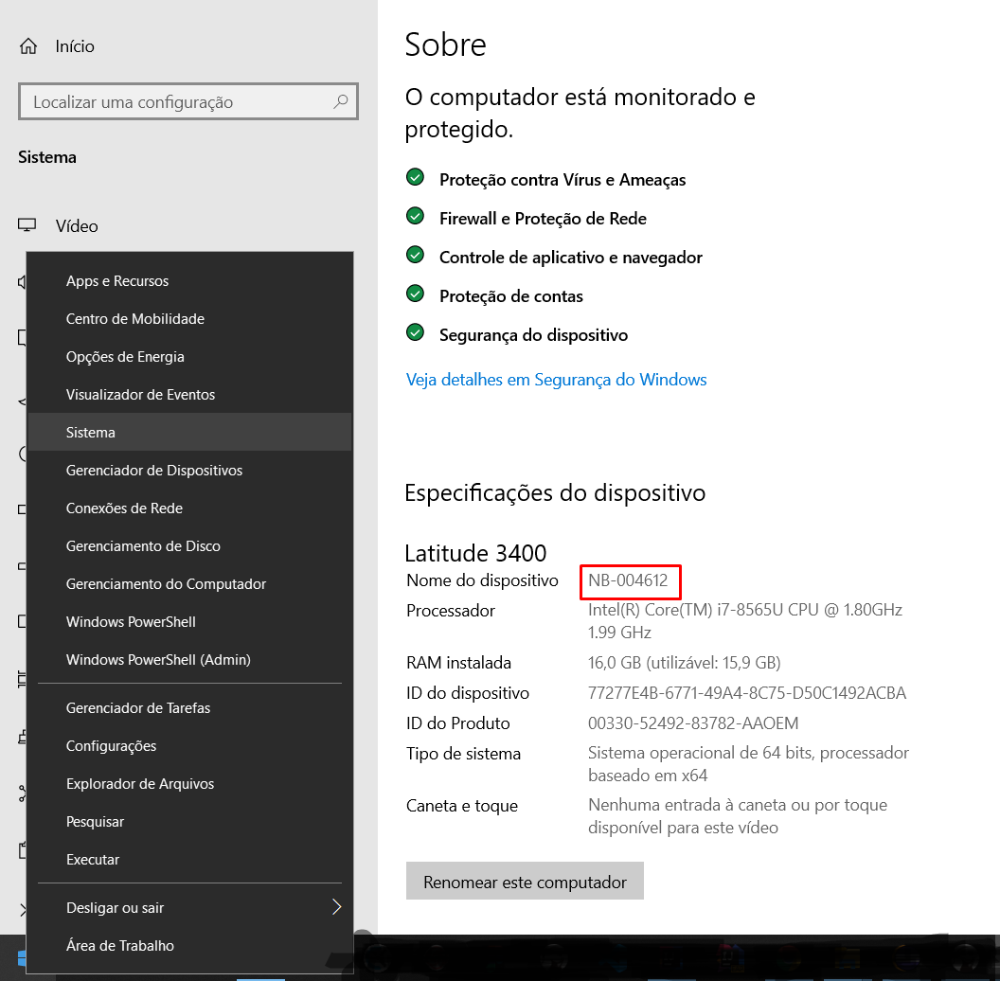
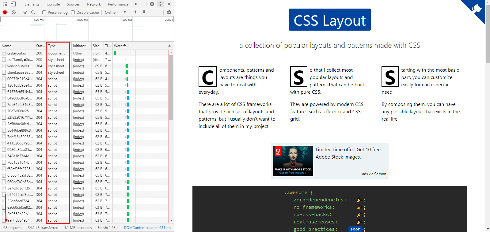

# SÉRIE DE COMO CRIAR UM PROJETO COM SPRING BOOT

### Etapa 2 - Comunicação de um sistema Web

Para entendermos como um sistema web funciona vou criar um sistema simples que fará uma lista de compras do mercado. Onde que iremos adicionar a quantidade e os produtos que precisamos comprar no mercado.
Sendo assim vamos pensar que precisaremos de 2 telas para os usuários farezem essa lista de compras.

1. Tela para incluir a quantidade e os produtos
2. Tela para listar todos produtos que será necessário comprar

- Controllers - Controladores

    Os controladores ou chamado em alguns casos de rotas, são as entradas dos sistemas web.
    

- Resources - Recursos

- Serviços
- Repositórios
- Entidades
- Banco de dados


Vamos iniciar essa etapa com um conteúdo um pouco mais teórico, porém de muita importância para entendermos para o que iremos desenvolver

Vamos primeiro falar de como os computadores conversam um com o outro.

Nossos computadores se localizam dentro de 2 redes, a rede privada e a rede pública.

- A rede privada, se refere a comunicação entre os equipamentos que se comunicam a partir de seu modem, por exemplo, na sua casa possui 1 computador, 2 notebooks e 4 celulares e todos estão conectados através de seu modem. Sua rede privada tem acesso a 7 equipamentos.
    
    A identificação de cada computador na rede privada é seu IP privado e também possuímos um nome em cada dispositivo.
    
     Para visualizar seu ip interno, abra o aplicativo Prompt de Comando no Windows e digite o comando
     
     ```
        ipconfig
     ```
  
    O resultado será semelhante a este abaixo, onde mostra seu Endereço de IP, em meu exemplo __192.168.0.137__ 
    ```
       Adaptador de Rede sem Fio Wi-Fi:
        
       Sufixo DNS específico de conexão. . . . . . :
       Endereço IPv4. . . . . . . .  . . . . . . . : 192.168.0.137
       Máscara de Sub-rede . . . . . . . . . . . . : 255.255.255.0
       Gateway Padrão. . . . . . . . . . . . . . . : 192.168.0.1
    ```
    
    Clicando com o botão direito sobre o Windows e indo na opção Sistema, podemos ver o nome também
    
     
- A rede pública é a comunicação de todos os computadores, onde que de nossos navegadores acessam outros computadores que avisam a internet que querem ser públicos, por exemplo sites conhecidos como a google.com.br, facebook.com e etc...

    A identificação de cada site na rede pública também são os IP's públicos, além dos nomes que digitamos na URL (domínios), que facilitam para não precisar lembrar dos IP's públicos.  
    


__O que os navegadores fazem para abrir uma página da internet?__

Ele primeiramente chama no servidor o que você pediu na URL do navegador, essa solicitação é feita para o nome ou Ip privado do servidor enquanto você está desenvolvendo e normalmente possui mais um complemento, para direcionar exatamente o que deseja para o usuário. 
(Exemplo: localhost:8080/produtos/incluir = Vai no servidor localhost e pede para a porta 8080 se tem ~~algum controlador~~ alguma coisa disponível com o caminho "/produtos/incluir"), em nosso caso terá um controlador que devolverá um HTML com um formulário.

Quando o navegador receber o HTML que solicitou ele confere se possui outras solicitações de arquivos neste HTML que ele precisa processar, estes arquivos são geralmente CSS's, Javascript's, fontes, imagens ou até mesmo arquivos de outros sites, caso possuir, ele vai lá fazer o donwload de cada um desses arquivos.

Então quer dizer que para cada URL que digito no meu navegador ele faz downloads do HTML, de imagens, arquivos CSS, fontes, Javascript e outros em meu computador? ISSO MESMO!

Aqui tenho o exemplo de acesso ao site [CSS LAYOUT](https://csslayout.io/), podemos ver que uma página relativamente simples, está carregando 68 arquivos diferentes.


Nós como desenvolvedores, precisamos então preparar o HTML para usar o mínimo de quantidade e tamanho de arquivos possíveis, para o carregamento da página se tornar mais rápido.

__Entendendo tudo isso acima, como nosso computador/servidor vai oferecer HTML para os navegadores?__

As aplicações desenvolvidas em nosso computador precisam de um _Servidor Web_ que fazem o trabalho de disponibilizar para os navegadores/internet os arquivos

Quando iniciamos a aplicação, aparece quando o servidor web (Tomcat) iniciou e em qual porta (8080), temos o exemplo nos nossos logs conforme abaixo: 
```
INFO 13088 --- [  restartedMain] o.s.b.w.embedded.tomcat.TomcatWebServer  : Tomcat started on port(s): 8080 (http) with context path ''
```
